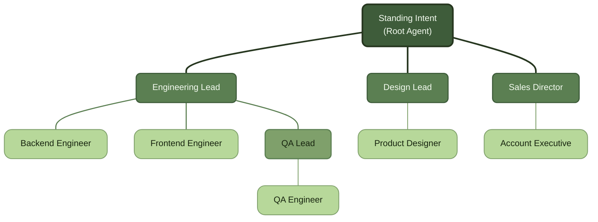

# Canopy

**Build AI-agent organizations as literal, executable org charts.**

Canopy lets you define an organization — a software team, a franchise, a research lab, a support desk, anything with roles and a reporting chain — and have it actually run. You pick an organization type, drop agents onto a chart, wire up who reports to whom, and give the root agent an intent. From there, delegation, artifact hand-offs, budgets, and escalations all follow the shape of the chart you drew.

The chart isn't a diagram of the system. It **is** the system.

## The idea, in short

- **Organizations are typed and nestable.** A `software-company` offers a different role palette than a `franchise-operation` or a `research-lab`, and any organization can nest child organizations — a support center inside a SaaS company, a single store inside a franchise network.
- **Every node is an agent, fully encapsulated.** Agents run in isolated workspaces, carry durable memory across engagements, and can never read or write another agent's workspace. They collaborate only through artifacts and messages the platform mediates — the same discipline a real org's reporting lines and confidentiality boundaries enforce.
- **Communication and delegation follow the chart.** A manager delegates only to its direct reports. Two peers in different teams talk through their common manager, unless the chart explicitly opens a scoped, temporary channel between them — the exception is deliberate, not a loophole.
- **Every responsibility ends in something checkable.** An agent's output is either an artifact (a document, a patch, a dataset) or an attestation that a real-world action happened (a call made, an approval granted). Nothing is "done" by vibes.
- **Salary is a first-class constraint, enforced by the framework — not the model.** Every agent has a token budget; every model and tool call is metered between steps by the runtime itself. Managers see burn rate, plan progress, and stalls in real time, and can intervene before a runaway task becomes a runaway bill.
- **Roles are data, not code.** The core engine has no idea what a "software engineer" or a "line cook" is. Organization types, roles, and team formations are catalog entries anyone can extend.

## What it looks like

A Canopy organization has a trunk (the root intent), limbs (managers), and a canopy of individual agents doing the actual work — and like a real tree, it's rarely symmetric. Some branches are dense with specialists; others are a single agent handling everything in their corner.

Engineering grew a full sub-branch because the work needed it; Design and Sales stayed a single agent each because that's all their slice of the intent required. That asymmetry is the point — Canopy charts are shaped by the work, not forced into a uniform template.

## Current status

Canopy is in the **design phase** — no runtime code yet, just the domain model and catalog that everything else will be built on. See `docs/` for the full picture:

| Doc | What's in it |
|---|---|
| [`docs/domain-model.md`](docs/domain-model.md) | The core abstractions — Organization, Agent, Assignment, Gate, BudgetMeter, Step — their lifecycles, and the invariants the runtime must honor |
| [`docs/archetypes.md`](docs/archetypes.md) | 26 organization types, from software teams to franchises to research labs, each with example roles and dynamics |
| [`docs/roles.md`](docs/roles.md) | ~75 catalog roles, each with responsibilities written as duty → deliverable |
| [`docs/teams.md`](docs/teams.md) | Reusable team formations — pre-wired manager + report subtrees with their artifact flow and dependencies |
| [`docs/use-cases.md`](docs/use-cases.md) | The out-of-the-box acceptance suite: what you can ask for on day one |

Planned direction: a Python SDK (decorator-based agent authoring, CrewAI as a swappable execution backend behind a clean seam), a FastAPI control plane, pluggable sandbox isolation, and a WYSIWYG org-chart editor. The core framework and control plane are intended to be fully open source (Apache-2.0); a hosted service is the eventual commercial layer on top.

## License

Not yet finalized in this repo. Apache-2.0 is the intended license for the core framework and control plane once code lands.
