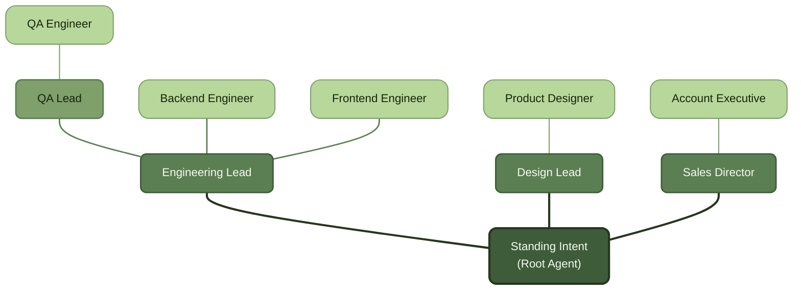

# Canopy

**Build AI-agent organizations as literal, executable org charts.**

Canopy lets you define an organization — a software team, a franchise, a research lab, a support desk, anything with roles and a reporting chain — and have it actually run. You pick an organization type, drop agents onto a chart, wire up who reports to whom, and give the root agent an intent. From there, delegation, artifact hand-offs, budgets, and escalations all follow the shape of the chart you drew.

The chart isn't a diagram of the system. It **is** the system.

## The idea, in short

- **Teams are typed and nestable.** A `software-company` team offers a different role palette than a `franchise-operation` or a `research-lab`, and any team can nest child teams — a support center inside a SaaS company, a single store inside a franchise network. *(A team is the actuatable chart; what Canopy called an "Organization" before the 2026-08 vocabulary correction — [`docs/design/organizations/`](docs/design/organizations/).)*
- **Organizations group teams behind hard walls.** An Organization is a named, budgeted, isolated group of teams — your company's fleet next to your personal fleet, sharing one provider subscription under governed capacity: window gauges, per-team burn attribution, throttle knobs with predicted effects, and automatic hold-and-resume when a quota window exhausts.
- **Every node is an agent, fully encapsulated.** Agents run in isolated workspaces, carry durable memory across engagements, and can never read or write another agent's workspace. They collaborate only through artifacts and messages the platform mediates — the same discipline a real org's reporting lines and confidentiality boundaries enforce.
- **Communication and delegation follow the chart.** A manager delegates only to its direct reports. Two peers in different teams talk through their common manager, unless the chart explicitly opens a scoped, temporary channel between them — the exception is deliberate, not a loophole.
- **Every responsibility ends in something checkable.** An agent's output is either an artifact (a document, a patch, a dataset) or an attestation that a real-world action happened (a call made, an approval granted). Nothing is "done" by vibes.
- **Salary is a first-class constraint, enforced by the framework — not the model.** Every agent has a token budget; every model and tool call is metered between steps by the runtime itself. Managers see burn rate, plan progress, and stalls in real time, and can intervene before a runaway task becomes a runaway bill.
- **Roles are data, not code.** The core engine has no idea what a "software engineer" or a "line cook" is. Team types, roles, formations — and connector packs (GitHub, local-git) — are catalog entries anyone can extend.
- **The chart reaches outward, legibly.** Connectors are dragged onto the canvas like roles: an instance pill, a scope edge to the whole team or a single node, write-only credentials, and a capability mask — an agent's external reach is readable from the chart alone, and work can arrive on its own through triggers ("new issues labeled `bug` → an intent"). ([`docs/design/builder-connectors.md`](docs/design/builder-connectors.md))
- **Structure is a hypothesis you can test.** The experiment lab (post-MVP, adopted) runs frozen team variants against each other on the same tasks — measured costs, programmatic probes, blinded judge panels — and promotes a cheaper-but-no-worse champion only through a gate you ratify. ([`docs/design/experiments/`](docs/design/experiments/))

## What it looks like

A Canopy organization has a trunk (the root intent), limbs (managers), and a canopy of individual agents doing the actual work — and like a real tree, it's rarely symmetric. Some branches are dense with specialists; others are a single agent handling everything in their corner.


```mermaid
%%{init: {'theme': 'base'}}%%
graph BT
  classDef trunk fill:#3E5C3A,stroke:#26361F,stroke-width:3px,color:#F4FBF0,rx:10,ry:10;
  classDef limb fill:#5B7F52,stroke:#3E5C3A,stroke-width:2px,color:#F4FBF0,rx:8,ry:8;
  classDef twig fill:#7FA06B,stroke:#5B7F52,stroke-width:2px,color:#17240F,rx:8,ry:8;
  classDef leaf fill:#B7D89A,stroke:#7FA06B,stroke-width:1.5px,color:#17240F,rx:14,ry:14;

  Root["Standing Intent<br/>(Root Agent)"]:::trunk

  Eng["Engineering Lead"]:::limb
  Design["Design Lead"]:::limb
  Sales["Sales Director"]:::limb

  QALead["QA Lead"]:::twig

  Backend["Backend Engineer"]:::leaf
  Frontend["Frontend Engineer"]:::leaf
  QA1["QA Engineer"]:::leaf
  Designer["Product Designer"]:::leaf
  AE["Account Executive"]:::leaf

  Root --- Eng
  Root --- Design
  Root --- Sales

  Eng --- Backend
  Eng --- Frontend
  Eng --- QALead
  QALead --- QA1

  Design --- Designer

  Sales --- AE

  linkStyle 0 stroke:#26361F,stroke-width:3px
  linkStyle 1 stroke:#26361F,stroke-width:3px
  linkStyle 2 stroke:#26361F,stroke-width:3px
  linkStyle 3 stroke:#5B7F52,stroke-width:2px
  linkStyle 4 stroke:#5B7F52,stroke-width:2px
  linkStyle 5 stroke:#5B7F52,stroke-width:2px
  linkStyle 6 stroke:#7FA06B,stroke-width:1.5px
  linkStyle 7 stroke:#7FA06B,stroke-width:1.5px
  linkStyle 8 stroke:#7FA06B,stroke-width:1.5px
```

Engineering grew a full sub-branch because the work needed it; Design and Sales stayed a single agent each because that's all their slice of the intent required. That asymmetry is the point — Canopy charts are shaped by the work, not forced into a uniform template.

## Current status

Three phases are implemented; the chart is built, actuated, **and worked**:

- **Phase 1 — Build**: the WYSIWYG org-chart editor and its thin persistence server
  ([`docs/org-chart-editor.md`](docs/org-chart-editor.md)). Pick an organization type, drop roles
  and formations onto a canvas, wire reporting lines and dependencies, nest child organizations,
  set salaries, serialize to one document.
- **Phase 2 — Actuate**: the actuation fabric ([`docs/actuation/`](docs/actuation/)). A control
  plane with a budget ledger (race-free hard-stops, step-id idempotency), a metered Model Gateway
  (mock / anthropic / gemini), sandboxed subprocess agents with charters, an agent directory, and
  a chart-derived message router with FIFO/DLQ delivery.
- **Phase 3 — Execute**: the work layer ([`docs/execution/`](docs/execution/)). Intents become
  assignment trees: staged delegation with plan-review approval, five gate kinds (clarification /
  dependency / approval / escalation / intervention), acceptance with rework funding, budget
  warn/hard-stop/stall triggers, durable per-node memory, git worktree executors with governed
  merges — and real work running as **headless Claude Code CLI sessions** (the `cli-claude`
  runtime, metered per turn), with a keyless `loop` + `mock` spine for dev and CI. The Operate UI
  covers it end to end: intent console, living plan, approvals inbox, mission control + org
  pulse, per-agent inspector, cost explorer, all pushed live over SSE.

The E-series (E1–E8) is complete, capped by Canopy's first self-PR — a design proposal authored,
reviewed, and PR'd by a Canopy org working on this repo. Connectors + triggers shipped next: the
builder binds GitHub/local-git instances with on-canvas scope, PR-create is a governed action, and
issue triggers generate intents on their own. **The C-series is built (C1–C7,
[`docs/design/organizations/`](docs/design/organizations/), adopted 2026-08-09)** — the MVP's
last prerequisite: **Organizations** own **Teams** (the vocabulary correction, migrated end to
end); the portfolio home groups teams by organization with vitals and actuation at a glance; and
**capacity governance** makes one shared subscription safe for a fleet — provider-anchored window
gauges with source + age on every number, per-team burn attribution (the operator's own usage as
its own band), throttle knobs (pause · session cap · pacing · tier cap · priority · active hours)
with predicted effects, org budgets, shares and reserves under contention, and a fallback ladder
(hold-resume · degrade-model · switch-account · extra-usage · park) that holds work reversibly at
the turn boundary and resumes it at the provider's reset — through control-plane restarts.
Cadences consult the same governor. Declaring the MVP delivered is the operator's release call
([`docs/execution/mvp.md`](docs/execution/mvp.md)); after it, the L-series
([`docs/design/experiments/`](docs/design/experiments/)) adds the experiment lab.

## Quickstart — run the software team

**Prerequisites:** Node ≥ 20 with [pnpm](https://pnpm.io), Python ≥ 3.11 with
[uv](https://docs.astral.sh/uv/). **No API keys needed** — the default `mock` provider and
`loop` runtime make the whole flow free and deterministic.

```sh
pnpm install                 # UI deps
uv sync --project server     # server deps
pnpm dev                     # server :8700 + UI :5173 → open http://localhost:5173
```

Then, in the app (the home page is the **portfolio**: your organizations, each with its teams;
a `default` organization exists from the first boot):

1. **Build** — *New team* (inside the default organization, or *New organization* first) → pick
   a software team type → *Start from a formation* → stamp the **Product Engineering Pod** (an
   engineering lead with backend, frontend, and QA reports).
2. **Bind** — in the editor's team settings, create an Agent Profile (provider `mock`, model
   `mock-1`, no key) and bind it to each node. Every node needs a binding before actuation.
3. **Actuate** — the *Actuate* page (or the editor toolbar) → **▶ Actuate**. Readiness issues are
   listed with fixes; a few seconds later the team is live: each node is a real sandboxed process.
4. **Work** — the *Execute* page: submit an intent (e.g. *"Add CSV export; all tests must
   pass"*). The lead plans and fans out; the **plan review** card lands in your inbox with the
   actual proposed delegations — approve it, then watch the living plan advance, the team pulse
   tick, and the deliverable arrive for your acceptance. The *costs* tab shows the burn
   (all zeros on `mock`); clicking any node name opens the full agent inspector.
5. **Govern** — the *Capacity* page (`[capacity] enabled = true` in `canopy.toml`, or
   `CANOPY_CAPACITY=1`): every provider window with its source and age, who is burning it, runway,
   and the what-if strip; each team card carries Pause/Resume and a knob panel whose chips predict
   the effect before you commit. Each organization's page carries its weekly budget, share, and
   reserve. On `mock`, the fake CLI's limit script lets you watch a window exhaust, sessions hold
   at the turn boundary as *scheduled waiting*, and resume at the scripted reset — the worked
   example in [`docs/design/organizations/README.md`](docs/design/organizations/README.md),
   keyless.

**Real CLI sessions:** with a logged-in [Claude Code](https://claude.com/claude-code) CLI on your
PATH, set `runtime_override = ""` in `canopy.toml` — engineer-class roles then run their
assignments as metered headless `claude` sessions with the Canopy MCP server as their tool plane
(see [`docs/execution/cli-runtime.md`](docs/execution/cli-runtime.md)). The `mock` gateway
provider needs no key either way; `anthropic`/`gemini` profiles take real keys via the
encrypted secret store.

See `docs/` for the full picture:

| Doc | What's in it |
|---|---|
| [`docs/domain-model.md`](docs/domain-model.md) | The core abstractions — Organization, Team, Pod, Agent, Assignment, Gate, BudgetMeter, Step — their lifecycles, and the invariants the runtime must honor |
| [`docs/archetypes.md`](docs/archetypes.md) | 26 team types, from software teams to franchises to research labs, each with example roles and dynamics |
| [`docs/roles.md`](docs/roles.md) | 87+ catalog roles, each with responsibilities written as duty → deliverable |
| [`docs/formations.md`](docs/formations.md) | 17 reusable formations — pre-wired manager + report subtrees with their artifact flow and dependencies |
| [`docs/design/`](docs/design/) | Adopted design series: connector governance ([`connectors/`](docs/design/connectors/)), builder connectors + triggers, organizations & capacity ([`organizations/`](docs/design/organizations/), the pre-MVP C-series), and the experiment lab ([`experiments/`](docs/design/experiments/), the post-MVP L-series) |
| [`docs/use-cases.md`](docs/use-cases.md) | The out-of-the-box acceptance suite: what you can ask for on day one |
| [`docs/org-chart-editor.md`](docs/org-chart-editor.md) | Phase-1 front-end design spec: the editor, its REST contract, the serialization format, and the validation rules |
| [`docs/actuation/`](docs/actuation/) | Phase-2 design suite: control plane, sandbox, message router, budget ledger, and the debt ledger that kept the seams honest |
| [`docs/execution/`](docs/execution/) | Phase-3 design suite: the work model, execution engine, CLI runtime, operator experience, and the E1–E8 milestone plan (`mvp.md`) |

## Development

`pnpm dev` runs both processes: the FastAPI server on **8700** (with `--reload`) and Vite on
**5173** with `/api` proxied. One command, one URL.

**Production** (single port serves API + built UI):

```sh
pnpm build                                   # builds the UI into ui/dist
uv run --project server uvicorn canopy_server.main:app --port 8700
```

**Checks:**

```sh
pnpm typecheck    # tsc + ruff + server import
pnpm test         # vitest (UI) + pytest (server), incl. shared validation golden vectors
```

Organizations are stored as one JSON document each under `data/organizations/<uuid>.json`
(gitignored). Export/Download produces a canonical `<slug>.organization.json` you can version and
hand off; Import/Upload round-trips it back in with fresh ids.

### Architecture at a glance

- **`catalog/catalog.json`** — the machine-readable catalog (26 team types, 87+ roles, 17 formations, tool grants, connector packs), transcribed from the domain docs and integrity-checked in CI.
- **`server/`** — the FastAPI control plane: the authoritative validator and team store (SQLite), budget ledger, Model Gateway, actuator + sandbox, message router/bus, the execution engine (`engine/`) with its gates and triggers, connector instances + the trigger scheduler, repo executors (incl. governed PR-create against GitHub), the operator REST + SSE surface, and the Canopy MCP server agents use as their tool plane. The C-series adds the organization store, capacity ledger + quota adapters, and the portfolio scheduler.
- **`agent/`** — `canopy-agent`, the runtime that boots inside each sandbox: the keyless `loop` runtime and the `cli-claude` adapter that drives headless Claude Code sessions and reports settled Steps.
- **`ui/`** — React + Vite: the React Flow chart editor (zustand/zundo, mirrored Zod validator) plus the Operate surface (intent console, living plan, inbox, mission control, inspector, cost explorer) over react-query + SSE.
- **`examples/target-app`** — the seeded work object: a small FastAPI expense-reports service with a deliberately red acceptance suite, so a fresh org has something real to fix.
- **`testdata/validation/`** — shared golden vectors that keep the Python and TypeScript validators byte-for-byte in agreement.

Everything is seam-first: SQLite, the subprocess sandbox, the local bus, and the encrypted secret store are all registry-selected implementations behind interfaces (`canopy.toml` picks; swapping one is a config line, not a refactor). The core framework and control plane are intended to be fully open source (Apache-2.0); a hosted service is the eventual commercial layer on top.

## License

Not yet finalized in this repo. Apache-2.0 is the intended license for the core framework and control plane once code lands.
