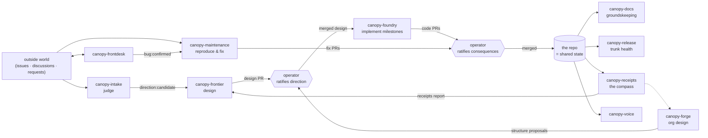

# Canopy Inc. — The Staff Organization

**Status:** Draft org design (proposed for adoption; the operator adopts by ratifying this document, amends it like any direction) · **Date:** 2026-08-16
**Upstream:** `mission.md` (the mission this org exists to demonstrate), `org-roadmap.md` (the trust bring-up ladder this steady state grows out of), `design/doctrine.md` (how the mission reaches every seat below), `domain-model.md` (the machinery), `archetypes.md` / `roles.md` / `formations.md` (the palette), `design/organizations/` (the Organization this roster lives under).
**Reads with:** `risks/README.md` — every team here is somebody's standing answer.

---

## 1. What this document is

The roster of standing teams under the **`canopy-inc`** Organization: the org design of Canopy's own staff, at cruise. `org-roadmap.md` sequences *bring-up* — which team earns existence next and what capability it pulls. This document describes the *destination*: the running organization those rungs grow into, each team chartered as a standing department with an intake, a behavior, outputs, and an operator surface.

The mission's success condition (`mission.md` §3) is the design constraint throughout: the operator approves **direction** (documents merged to the repo) and **consequences** (pull requests, publishes, outward speech), and nothing else is mandatory. Every team below is shaped so that its normal operation consumes only those two duties — plus inspection, which is a right and never a chore.

**Mapping to the ladder:** O2 = `canopy-docs` · O3 = `canopy-maintenance` · O4 = split into `canopy-intake` (judgment) + `canopy-frontier` (spec) + `canopy-foundry` (build) · O5 = `canopy-forge`, generalized · O6 = `canopy-voice` · O7 = `canopy-frontdesk` · O8 = the `canopy-inc` Organization itself, plus this document. The ladder's standing rules (`mission.md` §4) bind every team regardless of founding order.

## 2. Operating principles

**P1 — The repository is the coordination medium.** Organizations are hard-walled and teams do not talk chart-to-chart (`design/organizations/01` §5, §9.2 — the door stays undesigned until needed). This org treats that constraint as a feature: **the shared state of Canopy Inc. is the repo itself.** Merged documents are ratified direction; merged PRs are ratified work; issue labels are the protocol by which one team's output becomes another team's intake. Nothing crosses between teams except what the operator has already ratified into the repo, or what a label state-change carries. Corollary: **every team is self-contained** — it depends on repo *state*, never on another team's *availability*. A stalled or deactuated team degrades throughput, never correctness.

**P2 — Two approvals, and everything else is a view.** Each team declares its operator surface below, split into **ratify** (blocks the team; must fit the attention budget) and **digest** (informational; read when convenient). The org-wide sum of *ratify* items is the true capacity limit of Canopy Inc. — attention, not tokens (`mission.md` §2). If the sum outgrows the operator's week, that is a `canopy-forge` re-org signal, not a prompt to skim.

**P3 — Nothing reaches a pull request unvalidated.** A PR is never an experiment. Validation happens *before and beneath* it, at three distinct layers: **direction** is validated when the operator merges the design document (nothing is built that wasn't ratified as words first); **implementation** is validated structurally — verify-dependencies, QA suites, review roles wired into the formation, so validation is topology, not diligence (`domain-model.md`); **structure** — new teams, roles, instructions — is validated on the experiment bench (`design/experiments/`) or by pilot-with-sunset (§5). By the time work is a PR, the only question left for the operator is the one only they can answer: *do I ratify this consequence?*

**P4 — Autonomy enters at intake only.** Restating `mission.md` §4.5 because this roster leans on it: cadences and triggers replace the operator *typing*, never the operator *deciding*. Every team below runs unattended at intake and remains fully governed at plan review, acceptance, and every governed action.

**P5 — Teams are hypotheses.** Every team in this roster carries a done-bar for *founding* (below) and is subject to receipts (`canopy-receipts`) for *continuing*. A team whose numbers stay bad is redesigned or stood down by the same path that created it (§5). The roster is a living claim about the ideal structure, not a constitution.

## 3. The flow

The loop reads: the world and the operator feed **judgment** (intake, maintenance triage); judgment feeds **direction** (frontier); ratified direction feeds **production** (foundry, maintenance, docs); ratified production feeds **measurement** (receipts, release); measurement feeds direction again — and, through forge, reshapes the org itself. The operator sits at exactly two valves, both of which are merges.

**The label protocol (v1).** Inter-team hand-offs ride issue labels, because issue triggers are what exist today: `enhancement` → intake → `direction:candidate` or a governed decline comment · `direction:candidate` → frontier's queue · merged design + `design:approved` tracking issue → foundry's trigger · `bug` → confirmation (§4.4) → `bug:confirmed` → maintenance · frontdesk escalations → `bug` with evidence attached. Richer trigger kinds (§7) thin this protocol later; they do not change its shape.

## 4. The roster

Each entry: standing purpose (the doctrine-cascade purpose slot, `design/doctrine.md` DR-7, verbatim quotable), formation and roles (catalog keys; ★ = proposed catalog addition), intake, behavior, outputs → ratification, operator surface, trust tier and platform pulls, and the founding bar.

### 4.1 `canopy-frontier` — architecture & direction

**Purpose:** *"Decide what Canopy should build next and specify it well enough to build: turn the mission, the receipts, the risk register, and promoted candidates into implementation-ready design series — and keep the roadmap honest, including about what not to build."*

**Formation:** design cell ★ — `platform-architect` (lead) · `design-author` ★ ×1–2 (drafts numbered series in house style; duty → `DesignDoc` artifacts) · `design-critic` ★ (verify-edge on every design: attacks feasibility, grounding-in-what-exists, risk linkage, and milestone testability; duty → `DesignReview`). `product-manager` joins when requirement-shaping outgrows the lead.

**Intake:** weekly **frontier review cadence** (reads the current receipts report, `direction:candidate` issues, risk register, open debt ledgers → maintains a ranked direction queue artifact); episodic operator intents ("design the doctrine cascade"); `direction:candidate` label trigger.

**Behavior:** one engagement = one series or amendment. Staged plan review (the outline is the plan); author drafts; critic verifies at `delivered`; lead accepts → **design PR**. Amendments to `mission.md` or this document are always proposals — the operator's text is ratified, never rewritten in place. Frontier also *declines* candidates, with reasons, as recommendation artifacts — pruning is direction too.

**Outputs → ratification:** design-doc PRs (the operator's *direction* merge); direction-queue artifact (digest); decline recommendations (digest, or governed comment via intake's channel).

**Operator surface:** ratify — design merges (~1–3/wk), plan review per engagement (relaxable with trust). Digest — queue changes, declines.

**Trust & pulls:** tier-1, docs-only writes — the cheapest high-leverage team in the org; needs only O2's plumbing (GitHub pack, PR-create). **Founded when:** first series proposed → critic-verified → merged with ≤1 rework round, and the direction queue exists and is consulted by the operator instead of being re-derived in chat.

### 4.2 `canopy-foundry` — implementation

**Purpose:** *"Make ratified designs real: consume an approved design's implementation plan and work its milestones over time, delivering each as a reviewable pull request with its tests, until the series' done-bar is met."*

**Formation:** `product-engineering-pod` + review: `engineering-lead` (lead) · `backend-engineer` · `frontend-engineer` · `qa-engineer` (verify: full suite + new coverage) · `code-reviewer` (verify: diff review). All catalog roles; `code-reviewer` needs `defaultRuntime: cli-claude` set (§7).

**Intake:** dependency-driven, not cadence-driven — a merged design series. v1: a `design:approved` tracking issue fires the trigger (or the operator opens the standing engagement by hand); target: a pr-merged/path trigger (§7).

**Behavior:** **one design = one standing engagement; milestones are the pacing** — explicitly not one-shot. The lead reads the series (repo state, not hand-off), decomposes against the doc's own milestone table (the C1–C7 pattern), and works milestones sequentially: staged delegation batch (plan review) → worktree implementation → QA verify → reviewer verify → acceptance → governed PR-create. One milestone's PR can be under operator review while the next is in flight. A cadence heartbeat reports progress-against-plan. Where reality contradicts the design, the foundry does not improvise silently: it escalates (small deltas → operator; structural deltas → an issue labeled `direction:candidate`, closing the loop through frontier). WIP: one design series at a time until receipts argue otherwise (SC-2: the lead is the serialization point).

**Outputs → ratification:** milestone PRs (the operator's *consequence* merges); progress artifacts (digest); amendment escalations.

**Operator surface:** ratify — PR merges (~3–6/wk at cruise), plan review per milestone batch (relaxable), budget interventions. Digest — heartbeats.

**Trust & pulls:** execute-class on Canopy's own code — runs on the trusted-local waiver initially (own repo, not attacker-shaped input), docker when available; salary calibration (§7) before unattended cadence. **Founded when:** one full design series implemented milestone-by-milestone with acceptance rate the operator stopped watching nervously, and cost-per-milestone published.

### 4.3 `canopy-intake` — external judgment

**Purpose:** *"Read what the world asks of Canopy and judge it against the mission: every feature request gets a reasoned verdict — decline with respect, defer with criteria, or promote with a brief — so that direction candidates arrive at frontier already argued."*

**Formation:** triage cell ★ — `product-manager` (lead) · `triage-analyst` ★ ×1–2 (duty → `RecommendationBrief`: the ask, mission fit, rough cost class, risk linkage, verdict). Lead reviews every verdict at first; relaxes to spot-check via the acceptance-policy knob (D4) as trust grows.

**Intake:** trigger on `enhancement`-labeled issues; weekly sweep cadence for anything unlabeled; GitHub Discussions when a trigger kind exists (§7).

**Behavior:** per item: read, research the repo and docs, draft the brief, lead accepts → the verdict acts: promote (`direction:candidate` label — frontier's intake), defer (labeled with re-visit criteria), or decline (**governed outward comment** — outward speech stays approval-gated until boring, per the trust ladder). Never writes code, never designs — judgment only.

**Operator surface:** ratify — outward comments (early rungs only). Digest — verdict stream, weekly summary. **Trust & pulls:** tier-1 reads + governed speech; needs a comment-write grant in the GitHub pack (§7). **Founded when:** a month of verdicts whose promote/defer/decline distribution the operator endorses retrospectively, with zero un-ratified outward speech.

### 4.4 `canopy-maintenance` — bug close (O3, as chartered)

**Purpose:** *"Drive the open bug backlog toward zero: reproduce what's reported, fix what reproduces, prove the fix, and propose it — and say 'needs info' or 'invalid' with a maintainer's judgment when it doesn't."*

**Formation:** per `org-roadmap.md` §3: `engineering-lead` (lead) · `support-engineer` (triager; duty → `ReproReport`: reproducible-with-failing-test / needs-info / invalid) · `backend-engineer` (fix on `canopy/*`, behind a verify-dep on the repro) · `qa-engineer` (full suite + regression test).

**Intake:** trigger on `bug:confirmed`. **The confirmation gate is the interim docker stand-in:** reproducing arbitrary external reports means executing attacker-shaped input, and the roadmap's rule (`mission.md` §4.4, `org-roadmap.md` §2.4) makes T2 the floor for that. Until docker lands, only issues a human (operator, or later frontdesk) has confirmed carry the label; the unconfirmed backlog waits or gets triaged by hand.

**Behavior & outputs:** standing intent, backlog burn-down as its milestone view; fix PRs (ratify); `needs-info` / `invalid` comments (governed speech); repro corpus grows the regression suite. **Operator surface:** ratify — fix PR merges, early outward comments. Digest — triage verdict distribution (watch it look like a real maintainer's). **Trust & pulls:** docker (A6) for the full charter; confirmation-label protocol until then. **Founded when:** `org-roadmap.md` §3 O3's bar — ten merged fix PRs, median cost per closed bug and rework rate published.

### 4.5 `canopy-docs` — the groundskeeper (O2)

**Purpose:** *"Keep the written Canopy true: close documentation issues, reconcile docs with merged reality, and propose the amendments that stop the suite from drifting into disagreement with itself."*

**Formation:** `docs-pod` — `engineering-lead` (lead) · `tech-writer` · `editor` (verify). **Intake:** trigger on `docs`-labeled issues; weekly **drift-hunt cadence** — sweep recently merged PRs against the docs that describe those seams and file/fix discrepancies (the failure mode `plain-english/06` documents is this team's standing prey). **Outputs:** docs PRs (ratify); drift reports (digest). **Trust:** tier-1, no waiver — the proven E8 rung, cheapest to run continuously. **Founded when:** O2's bar (five merged docs PRs, cost per PR published) — already seeded.

### 4.6 `canopy-release` — trunk health & integration

**Purpose:** *"Keep the trunk shippable and the pipeline honest: watch CI, flakes, branch trains, and dependencies; propose merge sequencing; assemble release notes; run the live smoke — so that shipping stays boring."*

**Formation:** trimmed `platform-pod` — `platform-engineer` (lead) · `qa-engineer`. Small on purpose; it must not become a second foundry.

**Intake:** daily cadence (CI + branch state review); post-merge trigger later (§7).

**Behavior & outputs:** daily health artifact (digest); merge-sequencing proposals when trains stack (the C5–C7-unmerged situation is precisely this team's page-one item: *"three branches awaiting your ratification; drift risk grows weekly; suggested order attached"*); flake-fix and dependency PRs (ratify — small, boring by design); release-notes PRs at cut points; runs the live-smoke cadence and reports it. Separate from foundry so production never marks its own homework.

**Operator surface:** ratify — occasional small PRs (~0–2/wk). Digest — daily health line. **Trust & pulls:** mostly tier-1 reads; needs a CI/checks read grant in the GitHub pack (§7); small code writes under the waiver. **Founded when:** the operator learns trunk state from this team's artifact instead of from opening CI.

### 4.7 `canopy-receipts` — measurement (the compass)

**Purpose:** *"Turn the ledger and the repo's history into the org's receipts: cost per merged unit, acceptance and rework rates, human-minutes per PR, backlog burn — published on cadence, trends flagged, regressions escalated. The ledger is the product's honesty; this team reads it out loud."*

**Formation:** trimmed `data-insights-cell` — `team-lead` (lead) · `data-analyst`. `data-engineer` joins if extraction outgrows the analyst.

**Intake:** weekly cadence; per-release trigger later.

**Behavior & outputs:** weekly receipts report **committed to the repo** (`reports/receipts/` — ratify as a PR at first; relaxes to direct commit of a report artifact once boring); regression escalations (a worsening acceptance rate or cost trend → operator digest at minimum, `direction:candidate` issue when systemic — the receipts→frontier edge in §3); benchmark discipline (`mission.md` §4.3) — org-vs-solo comparisons once the experiment bench exists, honest reporting before then. **This is the standing answer to "how do we know we're going the right direction":** direction is *chosen*, not discovered — the operator chooses it at the design valve — and this team's job is making that choice informed and its consequences visible. When receipts and roadmap disagree, the disagreement is escalated, never smoothed.

**Operator surface:** ratify — the weekly report PR (~1/wk, fast). Digest — trend flags. **Trust & pulls:** tier-1; needs a read path into the ledger — a `ledger.read` grant/MCP surface (§7); interim: the operator exports cost data into the repo on cadence (an E8-style manual mile), and the team computes from repo + exports. **Founded when:** the operator cites the receipts report in a direction decision instead of asking for numbers ad hoc.

### 4.8 `canopy-forge` — org design & the catalog (O5, generalized; **the team proposer**)

**Purpose:** *"Improve the machine that does the work: harden role instructions against real transcripts, recalibrate salaries and envelopes against real burn, and propose changes to Canopy Inc.'s own structure — new roles, new teams, amendments to the roster — validated before proposed, ratified before real."*

**Formation:** `experiment-lab` — `lab-lead` (lead) · `evaluator` · `task-author` · `structure-proposer` (all existing catalog roles; the formation is the sanctioned self-improvement path — artifacts only, operator-ratified promotion).

**Intake:** monthly org-review cadence, reading what the platform already records: transcripts, rejection notes, gate latencies, queue depths, budget utilization, repeated-introduction signals (the domain model's own re-org tell), and the receipts trends.

**Behavior:** three output classes, three validation regimes — this is §2 P3 applied to structure:

1. **Role-instruction and calibration revisions** → catalog PRs. Validated champion-challenger on the experiment bench before proposing (the L-series' named customer is exactly this seat); before the bench exists, only conservative revisions, labeled as unbenchmarked, with before/after tracked in receipts.
2. **New roles and new teams** → amendment PRs to *this document* plus catalog additions. A new-team proposal is only proposable in this roster's own template — purpose, formation, intake, outputs, operator surface, trust tier, founding bar — **plus a sunset clause**: the receipts threshold and review date at which the team stands down if it isn't earning its keep. Teams are hypotheses with kill criteria (§2 P5); that is what keeps roster growth a validated direction rather than an accumulating experiment.
3. **Structural changes to existing teams** (formation edits, WIP, acceptance-policy knobs) → proposals through the same valve; applying them rides deactuate-edit-reactuate until live chart edits (D7/D8) land.

**Answering the meta-question directly:** yes, the org has a team proposer, and it is exactly one team — a single writer for structure prevents chart thrash. Any team can *signal* (escalate an observation about its own shape); only forge investigates and proposes; only the operator ratifies; every adopted team enters at the bottom of the trust ladder regardless of function. The self-extension loop is governed at both ends and measured in the middle.

**Operator surface:** ratify — structure/catalog proposal PRs (~1/mo). Digest — org-review findings. **Trust & pulls:** tier-1 (analysis and proposals only — forge never edits the live org itself); full power arrives with the L-series (L1–L3); founding earlier in analysis-only mode is cheap and useful. **Founded when:** a forge-authored role revision measurably improves another team's acceptance rate — proven before proposed (O5's bar, unchanged).

### 4.9 `canopy-voice` (O6) and 4.10 `canopy-frontdesk` (O7) — the outward wing

As chartered in `org-roadmap.md` §3, unchanged here, founding deferred until the production core is boring: **voice** (`content-machine`: weekly build-log from merged PRs and receipts — "the receipts write the marketing"; publish governed) and **frontdesk** (`support-tier` on Discussions: answer with citations, grow the KB, escalate real bugs into maintenance's intake via `bug` + evidence — the org-to-org rehearsal that today needs no door beyond the label protocol). Their operator surface is small (publish approvals; escalation quality in digest); their receipts are engagement and deflection, not merges.

## 5. The self-extension loop, end to end

How the org changes its own shape, stated once: **signal** (any team, or receipts, or the operator) → **investigation and proposal** (forge, in this document's template, with validation per §4.8's three regimes) → **ratification** (operator merges the amendment — direction valve) → **instantiation** (team built in the builder from the ratified spec; enters at artifact-only trust regardless of function) → **measurement** (receipts, against the proposal's own sunset clause) → **promotion or stand-down** (through the same valve). The loop's guarantee, restated from §2 P3: structure is where experiments live — the bench, and pilots with kill criteria. Work products are never experiments; by the time anything is a PR, its direction was ratified and its implementation verified.

## 6. Founding order

Waves, not dates; each wave starts when the previous one's bars are met and its operator load is boring. This *functional* order deliberately front-loads the direction+compass loop while respecting the ladder's trust rules — no execute-class team before its tier is honest, no unattended cadence before capacity governance (met: C-series).

| Wave | Teams | Why now | Gate to next wave |
|---|---|---|---|
| **W1** | `canopy-docs` · `canopy-frontier` · `canopy-receipts` | All tier-1 doc-writers — cheapest real work; and W1 closes the *steering* loop first: direction proposed (frontier), consequences measured (receipts), machinery kept warm (docs) | frontier + docs founding bars; receipts report cited in a direction call |
| **W2** | `canopy-foundry` · `canopy-release` | Production, paired with its immune system; foundry consumes W1's first merged series | one series shipped milestone-wise; trunk health read from release's artifact |
| **W3** | `canopy-intake` · `canopy-maintenance` | Opening to external input, judgment first; maintenance under the confirmation-label protocol until docker | verdict distribution endorsed; O3's ten-PR bar |
| **W4** | `canopy-forge` (full) · `canopy-voice` · `canopy-frontdesk` | Self-improvement needs the L-series and real transcripts to chew on; the outward wing needs something worth narrating | forge's proven-revision bar; steady outward cadence |

*Amendment (2026-08-16):* running any wave **hands-off** is additionally gated by the H-series (`design/unattended/`): W1 at the daily-brief posture needs H1–H2, W2 needs H3–H4, W3 needs H5 (docker T2 for unconfirmed external input), and posture claims are checked per `design/unattended/06` — the readiness checklist and posture ladder (P0 attended → P1 office-hours/daily brief → P2 unattended-month).

## 7. What this roster pulls from the platform

Requirements this org design creates, in `org-roadmap.md` §4's format — vision-level pulls, not designs:

| Pull | Pulled by | Lands on |
|---|---|---|
| Trigger kinds beyond `github-issues`: label-change, pr-merged/path, discussions, checks | foundry, docs, release, intake | extends `design/standing-orgs.md` trigger model |
| Trigger-fired intents consult the governor (close CAP-D10) | every triggered team | `design/organizations/04` §9.4 |
| GitHub pack: comment-write (governed), checks/CI read | intake, maintenance, release | `design/builder-connectors.md` pack growth |
| `ledger.read` grant + read-only MCP surface (non-secret) | receipts | new small grant; interim manual export |
| Docker tier T2 | maintenance (floor), foundry (preferred) | A6, already promoted by the ladder |
| Salary/envelope calibration for cache-heavy real sessions | foundry first, then all | open meter-currency debt (F1 residual) |
| `defaultRuntime: cli-claude` on `code-reviewer` + new ★ roles | frontier, intake, foundry | catalog data change |
| ★ roles: `design-author`, `design-critic`, `triage-analyst` (+ design-cell, triage-cell formations) | frontier, intake | catalog additions via forge's valve (duty → deliverable discipline applies) |
| Doctrine cascade | every team | `design/doctrine.md` |
| Formation evidence + selection surfaces (campaigns, effect store, wizard chips) | frontier (evidence-cited designs), forge (campaign queue), the builder | `design/experiments/07-selection-and-evidence.md` (L7, proposed) |
| Unattended operations: ops envelope, daily brief + page channel, continuity, flow policies (incl. CAP-D10), threat posture + docker T2, readiness/soak/postures | every team the operator wants to leave running | `design/unattended/` (H1–H6, proposed) |
| Fleet-glance health model, artifact feeds + receipt cards, setup-as-product | the operator's daily loop over every team; the brief's card grammar | `design/ux/` (UX1–UX5, proposed) |
| C5–C7 merged to `main` | fleet-wide fairness/fallback | release's first page-one item |
| Live chart edits (D7/D8) | forge's structural changes | existing debt, now with a customer |

## 8. Open questions

1. **One foundry or many?** When two ratified designs queue, do we scale by cloning foundry teams (portfolio-parallel, more operator merges/wk) or by growing the one (SC-2 pressure on the lead)? Proposed: stay single until receipts show queue latency hurting, then clone — cloning is the more Canopy-shaped move and the operator merge budget is the real constraint.
2. **Where does security live?** A `security-engineer` seat inside foundry/release, or a standing audit cadence, or a W4 team? Threat-model debts suggest at least an audit cadence early.
3. **When does intake speak outward unattended?** Declines are the org's public face; proposed bar: a month of ratified comments with zero edits before the gate relaxes.
4. **Mission amendments** — frontier may propose; should anything *but* the operator's own hand edit `mission.md` §1–§2? Proposed: no — that file's core is operator-authored text forever.
5. **Org-level standing intent.** "Grow Canopy" as an intent on the Organization itself is deliberately deferred (`design/organizations/01` §9); this roster is the administrative stand-in. Revisit when doctrine + receipts have run for a quarter.
6. **Receipts independence.** Receipts measures teams including (eventually) forge's changes to receipts itself; if that reflexivity ever bites, the operator's export-and-audit path is the backstop.
