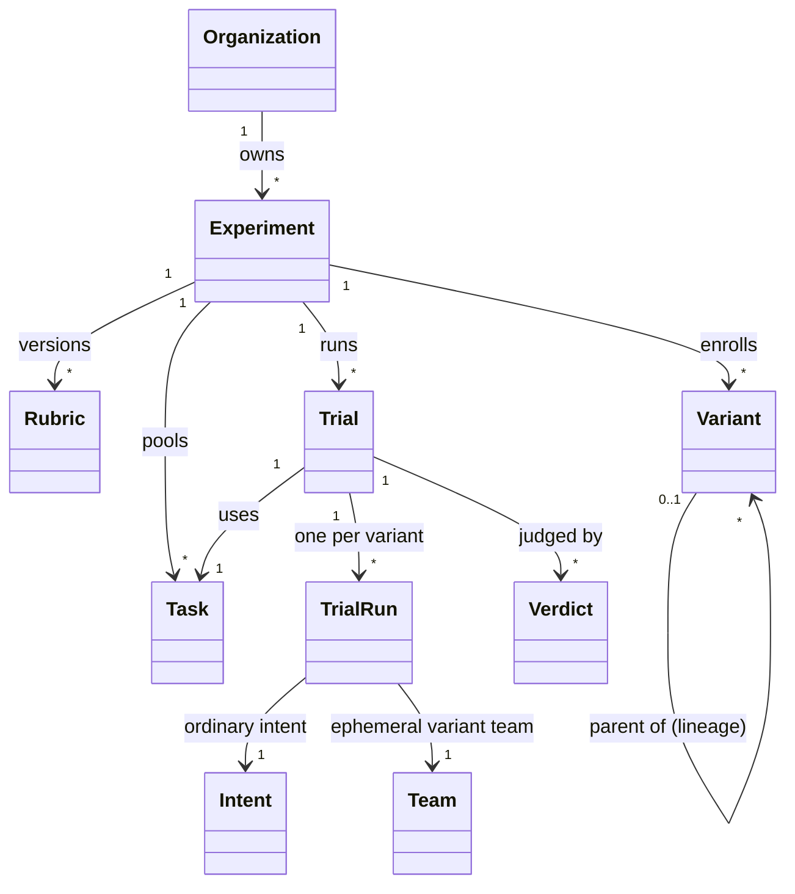

# 01 · The Experiment Model — entities, isolation, and fairness

> **Status:** Adopted 2026-08-09 (operator decision) — proposed by the experiments working group
> **Reads with:** `README.md` (this series), `../../domain-model.md`, `../organizations/01-team-and-organization.md` (Team/Organization vocabulary, invariant 12), `../organizations/04-scheduling-and-throttles.md` (priority, admission), `../../execution/work-model.md` (the stock objects trials are made of)

## 1. The entities at a glance



The load-bearing property: **`TrialRun → Team → Intent` is the entire interface to the work layer.** A trial run is one ordinary Intent submitted to one ordinary (if ephemeral) Team. Assignments, gates, plans, steps, meters, artifacts, memory — all stock, all recorded exactly as production records them. The experiment tables *reference* that record; they never duplicate or shadow it.

## 2. Experiment

```jsonc
// table: experiment   (owner-module: experiments.py)
{
  "id": "ex_m4k2p9q1",              // prefix ex_
  "orgId": "org_x1y2z3a4",          // the owning Organization — never cross-org
  "key": "ex-maint",                // stable kebab-case slug, unique per org
  "title": "Maintenance team efficiency",
  "purpose": "Find the cheapest maintenance team that closes bugs no worse than today's.",
  "state": "running",               // draft | running | paused | concluded | archived
  "rubricVersion": 1,               // active rubric (02 §3)
  "taskSource": {                   // §4
    "curated": true, "replay": true, "generated": true,
    "holdoutPct": 25
  },
  "policy": { "kind": "champion-challenger", /* 03 §4 */ },
  "envelope": { /* 03 §5 — the search boundary */ },
  "budget": {
    "ceilingUsd": 25.0,             // total experiment ceiling, estimates-denominated
    "perTrialAllowanceFactor": 1.0  // scales variant salaries per trial; 1.0 = production salaries
  },
  "baseline": { "solo": true },     // PF-1: auto-enroll the single-node baseline
  "memoryPolicy": "fresh",          // fresh | carry   (§6)
  "pairing": "concurrent",          // concurrent | serialized   (§6)
  "createdAt": "…", "updatedAt": "…"
}
```

Experiment state is administrative, not a work state machine: `running` means trials may be scheduled; `paused` stops new trials but never kills in-flight ones (the same courtesy the org budget ceiling shows running work); `concluded` freezes the record with a designated final champion; `archived` hides it from the lab home.

## 3. Variant

A variant is a **frozen, self-contained blueprint** of a competitor — everything needed to instantiate its team, and nothing that identifies where it came from at judging time.

```jsonc
// table: experiment_variant
{
  "id": "vt_b1x8s3t7",              // prefix vt_
  "experimentId": "ex_m4k2p9q1",
  "key": "B1",                      // short display key, assigned in enrollment order (A, B1, B2…)
  "label": "backend on sonnet-tier",
  "parentVariantId": "vt_a0…",      // NULL for seeds; the lineage edge
  "mutation": {                     // what changed vs parent — 03 §2's closed vocabulary
    "kind": "rebind-model",
    "nodeId": "a_be01",
    "detail": { "fromTier": "fable", "toTier": "sonnet" },
    "proposedBy": "sweep:model-downgrade",   // 'operator' | 'sweep:<key>' | node id (proposer)
    "predictedEffect": "cost −35–45%, correctness within floor"   // optional; closed loop in 05 §1
  },
  "blueprint": { /* full canopy.team document, v2 — chart, roles, extensions, salaries */ },
  "bindings": { "a_be01": {"profileId": "pf_…", "model": "…"}, /* per node */ },
  "schedule": { "maxConcurrentSessions": 2 },   // team_schedule knobs, equal across variants by default
  "status": "active",               // candidate | active | retired | champion | graduated
  "teamId": null,                   // the instantiated ephemeral team's id, set at first actuation
  "createdBy": "operator",
  "createdAt": "…"
}
```

Rules:

- **A variant is a snapshot, not a reference.** Enrolling a production team *copies* its document, bindings, and salaries at that moment. Editing the production team later never silently mutates a competitor; re-enrolling creates a new variant with `mutation.kind: "import"`.
- **One mutation per variant, by convention.** Attribution is the point of the lineage: "B4 differs from B1 by exactly this" is what makes 100 iterations legible. Multi-edit variants are allowed (`mutation.kind: "manual"`) but the bench discourages them (`04` §5). *(Amendment 2026-08-16: `mutation.kind: "campaign-cell"` is the sanctioned multi-factor exception — a campaign's design matrix carries the attribution the convention exists to protect. `07` §2.)*
- **The solo baseline** is a generated variant: one node carrying the seed team's primary production role (the operator can re-pick), production salary, no managers. It is enrolled at experiment creation when `baseline.solo` is true (default), and never retired automatically — it is the standing answer to PF-1 and the denominator of the whole product thesis.
- `status: graduated` records that this blueprint was promoted onto a production team (`05` §3); the variant stays in the lineage — graduation is provenance, not removal.

## 4. Task

```jsonc
// table: experiment_task
{
  "id": "tk_9f2h1k3m",              // prefix tk_
  "experimentId": "ex_m4k2p9q1",
  "origin": "replay",               // curated | replay | generated
  "state": "approved",              // proposed | approved | rejected   (generated tasks need review)
  "holdout": false,                 // §5 — never shown to the proposer; used only at promotion
  "tags": ["bug", "gnarly"],        // slice axis for the leaderboard (05 §1)
  "body": {
    "intentText": "…full markdown brief, exactly as an operator would write it…",
    "baseRef": "9fc31ab",           // repo pin: every run starts from this SHA (§6)
    "contractType": "PullRequest",
    "referenceRef": "team://canopy-maintenance/…@3"   // replay only: the accepted deliverable (§8.4)
  },
  "createdBy": "operator",          // 'operator' | node id (task-author)
  "createdAt": "…"
}
```

Three origins, in order of trust:

- **Curated** — the operator writes it. Approved by construction.
- **Replay** — imported from the owning org's *closed* intents (the picker in `04` §4). The richest source: real work, known-completable, with the historical cost and the accepted deliverable attached as reference metadata. Replay never touches the source team; it copies the intent text and pins the repo state the original ran against (or the closest available base).
- **Generated** — a task-author agent expands the pool from the experiment's purpose and existing tasks ("more like these, vary the surface area"). Generated tasks land as `proposed` and require operator approval before entering rotation — an unreviewed generator quietly steers the whole experiment, so review is the wall, not politeness. Generation arrives at L4 (`06` §1); until then curated + replay suffice.

> **Amendment (2026-08-16) — replay survivorship.** Replay imports only *closed* intents, so a replay-heavy pool systematically excludes the work that failed, stalled, or was cancelled — exactly where structural differences between teams matter most. A pool of survivors flatters every variant and narrows the spread the experiment exists to measure. Mitigations: the pool-health panel (`04` §4) reports **origin mix and a survivorship note** whenever replay exceeds ~⅔ of rotation; and at L4 the task-author's brief gains a standing quota of **failure-shaped tasks** — synthesized not from thin air but from the org's own rejection notes, rework chains, and stalled-intent transcripts (records the platform already keeps, even where no accepted deliverable exists to replay). Curated hard cases remain the operator's cheapest lever.

## 5. Holdout discipline

A fixed fraction of the pool (`holdoutPct`, default 25%) is marked `holdout: true` at approval time. Holdout tasks:

- are **never** included in the verdict/transcript corpus the proposer reads (`03` §3),
- are **never** used in regular trial rotation,
- run exactly once per promotion check: when the promotion predicate fires on rotation tasks (`02` §4), the challenger must confirm on the holdout set before the `champion-suggested` card is raised.

This is the anti-overfitting wall: a proposer that tunes instructions to the visible tasks meets tasks it has never seen at the door. Holdout tasks that have been consumed by a promotion check are retired from the holdout set (they are now visible in the record) and replaced — the bench nags when the holdout pool runs low (`04` §4).

## 6. Isolation and fairness

The comparisons are only as good as the controls. Each rule names its mechanism, per house style:

| Concern | Rule | Mechanism |
|---|---|---|
| Variant cross-talk | Variants never see each other, the experiment, or the rubric | Variant teams are ordinary Teams: team walls (router channels, artifact scoping, workspace isolation) already guarantee this. Nothing in a charter, brief, or workspace mentions the experiment. |
| Memory contamination | `memoryPolicy: fresh` (default): every node's durable memory is reset at trial start — each trial meets an identical team | The existing memory reset API ("backfill the position"), invoked by the harness. `carry` mode instead lets memory accumulate across trials *within* a variant — it measures the team as it would actually live, at the price of order effects; the leaderboard labels carry-mode scores as such. |
| Repo state | Every run starts from the task's pinned `baseRef` | `RepoManager` gains a `base_ref` parameter on worktree materialization (`06` §5); per-team clones are already isolated post-C1. |
| Salary parity | Variants keep their blueprint salaries — salary *is* an experimental variable; but the same task always carries the same allowance factor | `budget.perTrialAllowanceFactor` scales uniformly; a variant with trimmed salaries is a legitimate challenger (`03` §2). |
| Capacity conditions | Runs of one trial execute under the same window conditions | `pairing: concurrent` (default): all runs dispatch together with **equal** per-team session caps, so contention is symmetric. `serialized` runs them back-to-back for zero cross-variant contention at the price of drifting window state. Either way the trial records a capacity snapshot (window states at dispatch) for the record. |
| Time honesty | The timed factor is **active time** — Σ step durations — not wall clock | Gate-wait, capacity holds, and operator latency measure the operator and the subscription, not the team. Elapsed time is recorded and displayed, but unweighted by default (`02` §2). |
| Judge blindness | Judges see anonymized exhibits, never team identities or costs | `02` §5 — exhibit materialization and its honest limits. |

## 7. Budgets and scheduling

- **The experiment ceiling** (`budget.ceilingUsd`) is an admission budget in the org-budget mold (`../organizations/01` §6): crossing it stops *new* trials and raises `attention`; it never kills a running trial. Experiment spend counts inside the owning org's weekly ceiling — the lab is not a way around the org's budget.
- **Trial runs are `batch` priority, always.** Variant teams' schedules are forced `priority: batch`; experiments yield to interactive work by construction and are runway-courteous (the cadence-skip precedent, `../organizations/04` §9.4). A continuous experiment is the definitional background workload.
- **Evaluation spend is the experiment's, not the variant's.** Judge and task-author assignments are metered like all work, attributed to the lab, and reported as **evaluation overhead** on the experiment header (`05` §6) — the SC-1 coordination-overhead discipline, applied to the lab itself. A variant's score never includes the cost of judging it.
- **Per-run meters are stock.** Each run's assignments draw meters from the variant's own salaries — hard-stops, warn thresholds, rework funding all behave exactly as production. A run that hard-stops unresolved is a `completion` guardrail failure (`02` §2), not an operator page: intervention gates inside trial runs default to auto-resolution policies (top-up denied; the run fails honestly) unless the operator opts into hand-holding.

## 8. Trial and TrialRun

```jsonc
// table: experiment_trial
{
  "id": "tl_7q4w2e8r",              // prefix tl_
  "experimentId": "ex_…",
  "taskId": "tk_…",
  "rubricVersion": 1,               // pinned at creation — scores are stable under later rubric edits
  "pairing": "concurrent",
  "state": "judging",               // pending | dispatched | collecting | judging | scored | void
  "capacitySnapshot": { /* window states at dispatch */ },
  "createdAt": "…", "closedAt": null
}

// table: experiment_run           — one row per (trial, variant)
{
  "trialId": "tl_…", "variantId": "vt_…",
  "teamId": "tm_…", "intentId": "in_…",
  "state": "accepted",              // mirrors the intent's terminal state, plus 'void'
  "metrics": {                      // harvested at close from stock records — never self-reported
    "estCostUsd": 0.94, "estCostSource": "cache-aware",
    "tokens": {"input": …, "output": …, "cacheRead": …, "cacheCreation": …},
    "activeMs": 1841000, "elapsedMs": 5310000,
    "reworkRounds": 1, "operatorGates": 0, "agentGates": 2,
    "coordinationPct": 22.5, "stepCount": 61,
    "structure": {"nodes": 4, "depth": 2, "managers": 1}
  }
}
```

Trial lifecycle: `pending` (scheduled) → `dispatched` (intents submitted to every enrolled, non-retired variant) → `collecting` (runs completing; a trial-level timeout parks stragglers) → `judging` (probes + panel, `02` §5) → `scored` (verdict recorded, leaderboard updated). **`void`** is the honesty state: infrastructure failure, capacity parking beyond the timeout, or a task later found defective voids the *trial* (all runs), which is displayed but never scored — a variant is not punished for the harness's bad day. Voiding a task retroactively (a defective replay, an ambiguous generated task) voids its trials explicitly and visibly (`05` §6).

### 8.4 Replay reference outputs

Replayed tasks carry the historically-accepted deliverable (`referenceRef`). It is **not shown to judges by default** — a reference anchors judges to the incumbent's *style*, biasing against legitimately different approaches. It is available to programmatic probes (regression suites extracted from the original fix) and to the operator on the trial page. `rubric.judging.showReference: true` opts a rubric into reference-anchored judging where the domain truly has one right answer. *(Resolved decision 7.)*

## 9. Resolved decisions (alternatives considered)

1. **Variant teams live in the owning Organization.** *Rejected:* a dedicated lab Organization. Experiments serve the owning org's purpose and must draw its budget shares, repo bindings, and connector instances; a separate org would need cross-org plumbing that invariant 12 forbids. Variant teams carry `experimentId` on the team row and are excluded from portfolio team lists by default (`05` §5) — present, but not noise.
2. **Trials are ordinary intents.** *Rejected:* a bespoke "evaluation run" execution mode. Any special mode would make results unrepresentative of production and double the engine's test surface. The harness is an orchestrator and a reader, never a second engine.
3. **A variant is a snapshot** (§3). *Rejected:* variants as live references to teams — a moving competitor invalidates its own history.
4. **Ephemeral actuation, durable record.** Variant teams actuate lazily (first trial) and stay actuated between trials while the experiment runs (re-actuation per trial is pure overhead; F13's actuation-independent homes make either choice safe); retirement deactuates and deletes the team, and the experiment record — blueprints, metrics, verdicts, exhibits — is complete without it.
5. **Fresh memory is the default** (§6). Comparability beats realism for the default; `carry` exists for the operator who is explicitly testing a learning team.
6. **Voided trials are visible.** *Rejected:* silent retry. Silent retries are silent selection bias.
7. **References hidden from judges by default** (§8.4).
8. **The experiment is org-scoped, the task pool is experiment-scoped.** *Rejected for now:* a shared org-level task library. Attractive once two experiments want the same bug corpus; deferred until that exists (open question 4).

## 10. Open questions

1. **Shadow-mirroring live intents.** Replay is retrospective; mirroring a live production intent into variants ("shadow mode") would test on tomorrow's distribution, at real cost and real judging load. Deferred; the trial/run schema does not preclude it.
2. **Trial timeout defaults.** How long may a run sit capacity-parked before the trial voids? Leaning: 24h wall clock, configurable; decide at L1 with real data.
3. **Cross-experiment task libraries** (decision 8).
4. **Minimum rotation-pool size.** Below ~8 approved tasks, win rates are noise; the bench should warn rather than block (`04` §4). Exact threshold to be set against L3 experience.
5. **Carry-mode ordering effects.** If `carry` variants run tasks in different orders across trials, memory effects confound. Likely rule: carry-mode experiments fix task order. Decide when someone actually runs one.
