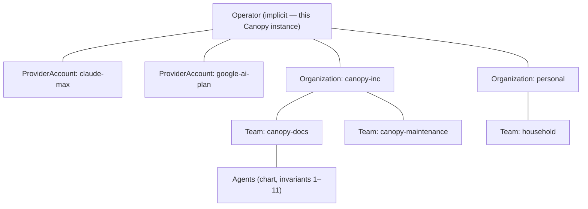

# 01 · Team and Organization — the domain model, corrected

> **Status:** Proposal — portfolio-and-capacity working group, 2026-08-08
> **Reads with:** `README.md` (this series), `../../domain-model.md`, `../../org-chart-editor.md` §3, `../../actuation/agent-profile.md`, `../../org-roadmap.md` §O8

## 1. The misnomer, named

What Canopy calls an *Organization* today is one actuatable chart: a root agent, its reporting tree, its dependencies, its salaries — the thing the editor draws and the actuator brings to life. In every real deployment scenario we have designed (the O-ladder, the MVP pod, the docs pod), that object is a **team**: a handful of agents with one purpose, one work target, one standing or episodic intent stream. The thing that is actually missing is what a real company has *above* its teams: the umbrella that names the purpose, holds the budget, and keeps one department's affairs out of another's.

The fix is a rename plus one new entity. It cascades through a second rename, because the word "Team" is already taken by a derived concept:

| Today | After this proposal | What it is |
|---|---|---|
| Organization | **Team** | The actuatable chart unit. Document kind `canopy.team`, `schemaVersion: 2`. Internally unchanged: agents, reporting tree, dependencies, child mounts, salaries, custom roles. |
| *(missing)* | **Organization** | A named, budgeted, isolated group of Teams. Never actuated itself; never a chart. |
| Team (derived: manager + direct reports, `domain-model.md` §Team) | **Pod** | The derived visibility grouping sharing one ArtifactSpace. The catalog already speaks this word (`product-engineering-pod`, `docs-pod`). |
| Formation (`teams.md`) | Formation (unchanged) | Reusable subtree blueprint. `docs/teams.md` retitles to `docs/formations.md` on adoption (see `07-implementation-plan.md` §7). |
| Child organization (nesting via `mountAgentId`) | **Child team** | Nesting stays *within* a Team, exactly as designed. Mounting is a chart mechanism; it does not cross Teams or Organizations. |

The rename is total: docs, schema, API, UI, code identifiers. We are early; migration friction is a cost we pay once (`07-implementation-plan.md` §2). The alternative — keeping "Organization" for the chart and inventing a new umbrella word — preserves a misnomer at the center of the product's vocabulary forever, and was rejected (§8).

## 2. The corrected entity model



Levels, top to bottom:

- **Operator** — the person running this instance. Not a stored entity in v1 (single-operator posture, `../../actuation/threat-model.md`); it is where ProviderAccounts and the capacity pools live, because a Claude Max login belongs to *you*, not to any one organization.
- **ProviderAccount** — a provider identity (a Claude Max login, a Google AI plan login, an API key). Defined in `02-capacity-model.md` §2. Organizations *draw on* accounts; they do not own them.
- **Organization** — the new entity. Flat set of Teams. Identity, budget, isolation boundary.
- **Team** — the chart. Everything below this line is exactly today's system.

## 3. Organization

```jsonc
// table: organization  (SQLite, owner-module: orgs.py)
{
  "id": "org_x1y2z3a4",          // prefix org_, nanoid(8)
  "key": "canopy-inc",           // stable kebab-case slug; unique; used in paths and refs
  "name": "Canopy Inc.",         // display
  "purpose": "Serves Canopy's own development.",  // one sentence, shown on the card
  "theme": { "color": "sage", "icon": "tree" },   // separation made visual (05-ux-portfolio.md §5)
  "priorityClass": "batch",      // default for member teams: interactive | batch (04 §3)
  "budget": {                    // §6
    "weeklyCostCeilingUsd": 40.0,      // estimates-denominated, alert + admission check
    "capacityShares": { "pa_claudemax": 70, "pa_googleai": 50 },  // percent of each pool (04 §7)
    "reserveWatermarkPct": { "pa_claudemax": 15 }                 // headroom held for interactive work
  },
  "createdAt": "…", "updatedAt": "…"
}
```

Rules:

- An Organization is **never actuated** and **has no chart**. It cannot receive an Intent. Work is always submitted to a Team.
- `key` is immutable after creation (it appears in filesystem paths and audit rows); `name`, `purpose`, `theme`, `budget` are freely editable.
- Deleting an Organization requires it to be empty of Teams (no cascade — Teams hold live state).
- Every Team belongs to **exactly one** Organization (`team.organizationId`, NOT NULL after migration). Moving a Team between Organizations is an explicit operator action, blocked while the Team is actuated, and audited — it is a *custody transfer*, not a drag-and-drop.

## 4. Team (what actually changes)

Almost nothing, deliberately. The Team document is today's Organization document with three edits:

1. `kind: "canopy.organization"` → `kind: "canopy.team"`, `schemaVersion: 1 → 2`. The importer accepts v1 documents forever: a v1 `canopy.organization` migrates to a v2 `canopy.team` and is assigned to the Organization the operator is importing into (or a `default` Organization on first boot — `07-implementation-plan.md` §2).
2. `childOrganizations` → `childTeams` (field rename; semantics of `mountAgentId` nesting untouched).
3. The document does **not** carry `organizationId` — membership is server-side state (like bindings and profiles), so an exported Team file stays portable between organizations and between operators. The export filename becomes `<slug>.team.json`.

Everything else — agents, roles, extensions, salaries, dependencies with `resolveOn`, custom roles, validation rules and codes, golden vectors — carries over verbatim under the new names. The eleven invariants of `domain-model.md` apply *within a Team*; they neither weaken nor extend across Teams.

Artifact refs migrate from `org://<org-slug>/…` to **`team://<team-slug>/<node-or-pod>/<name>@<version>`**. Readers accept both schemes indefinitely; writers emit `team://` from C1 (`07-implementation-plan.md` §2.4).

## 5. Membership and isolation — the new invariant

Proposed **invariant 12 — organization isolation** (numbering continues `domain-model.md`'s 1–11; the connectors series' proposed capability invariant renumbers behind it if both are adopted):

> Nothing crosses an Organization boundary except the operator. No message, no artifact ref, no dependency, no delegation, no shared secret, profile, repo, workspace, or memory. A Team cannot observe that other Teams — let alone other Organizations — exist.

Enforcement, by construction (never by prompt):

| Wall | Mechanism |
|---|---|
| Communication | Router channels are derived per-Team from the chart (unchanged); there is no channel constructor that spans Teams, and therefore none that spans Organizations. |
| Artifacts | `fetch_artifact` grant checks already scope to own-team outputs + refs granted via briefs; ref resolution refuses cross-team lookups. `team://` refs resolve only inside the caller's Team. |
| Secrets & profiles | Remain Team-scoped (status quo). Shared *capacity* comes from operator-level ProviderAccounts, referenced — never copied — by Team profiles (`02-capacity-model.md` §2). A secret is never readable across the wall because reads don't exist at all (write-only store, unchanged). |
| Filesystem | `data/orgs/<orgKey>/teams/<teamKey>/{work,repos,sandboxes,logs}` — the separation is visible in a directory listing (§7). |
| Views & notifications | Every operator surface below the portfolio home is org-scoped; notification streams never mix organizations (`05-ux-portfolio.md` §5). |
| Budgets | Org budget checks run at intent admission and in the scheduler; one organization's exhaustion never blocks another's admission (only shared *pool* exhaustion can, and that is reported as pool truth, not as an org's fault). |

What invariant 12 deliberately does **not** say: that Organizations will never collaborate. Org-to-org handoff (the O7 escalation path, the O8 vision) is real future work — but it will be designed as an explicit, operator-governed door (like brokered channels are for cross-pod work), not as an ambient capability. Until that door is designed, the operator carries work between organizations by hand, and that is correct.

## 6. Organization budgets

Budgets exist at three levels after this proposal, each with a distinct job and unit:

| Level | Object | Unit | Enforced |
|---|---|---|---|
| Assignment | BudgetMeter (unchanged) | tokens | mechanically, between Steps — the hard guarantee |
| Organization | `budget.weeklyCostCeilingUsd` + `capacityShares` | estimated dollars; percent of pool | at intent admission (warn, then refuse new intents when ceiling crossed — never kills running work) and in scheduler weighting |
| Operator | CapacityPool windows | provider-defined windows | by the provider; Canopy schedules against it (`04-scheduling-and-throttles.md`) |

The org ceiling is denominated in *estimated* dollars because that is the only honest cross-provider unit we have (`fmtCostHonest` rules apply; subscription tokens have no invoice). It is an **admission budget**, not a meter: crossing it stops *new* work from being admitted for the rest of the week and raises an `attention` notification; it never hard-stops an executing assignment (that remains the assignment meter's job). `capacityShares` are the org's claim on shared pools and live in the scheduler (`04` §7); the two are deliberately separate knobs — one bounds *spend*, the other divides *supply*.

Salary semantics below the Team boundary are untouched.

## 7. Filesystem and identity separation

The on-disk layout regroups under the organization, so the separation the operator asked for is legible at every layer of the system:

```
data/
  canopy.db                      # one DB, all rows org- and team-keyed (see 07 §4)
  master.key
  orgs/
    canopy-inc/
      teams/
        canopy-docs/     {work/, repos/, sandboxes/, logs/}
        canopy-maintenance/ …
    personal/
      teams/
        household/ …
  artifacts/                     # content-addressed, metadata rows carry org/team scope
```

`CANOPY_WORK_ROOT` (F13) becomes `data/orgs/<orgKey>/teams/<teamKey>` — preserving the actuation-independence that made `claude --resume` survive re-actuation, while making `ls data/orgs` answer "what lives on this machine" truthfully. Migration moves existing `data/work/<id>` and `data/repos/<id>` trees once, at C1 boot (`07` §2.5).

## 8. Resolved decisions (alternatives considered)

1. **Rename, not alias.** *Rejected alternative:* keep "Organization" for the chart and name the umbrella "Workspace"/"Portfolio". Rejected because the operator's stated mental model — and every doc we have written about the O-ladder — already uses "team" for the chart unit; carrying the misnomer forever costs more than one migration now. "Portfolio" survives only as the *UI* name for the operator-level whole, never as a domain entity.
2. **Organizations are flat groups, not charts.** *Rejected alternative:* realize O8 by mounting teams under a root coordination chart. Rejected for v1 because it manufactures communication topology nobody needs yet, drags every cross-team question (dependencies? escalation? shared artifacts?) into scope prematurely, and contradicts the observed need — *independent* concurrent teams. The chart-of-charts remains available later as an explicit door; adopting this proposal costs it nothing.
3. **Pod, for the derived grouping.** *Rejected alternatives:* "Crew" (collides with `build-crew` the formation), "Unit" (bloodless), "Squad" (collides with `incident-response-squad`). "Pod" wins on existing catalog usage; the two formations whose keys end in `-pod` read naturally as "formations that stamp a pod".
4. **Membership lives server-side, not in the document.** Keeps Team exports portable and keeps the document schema honest — a Team file describes a chart, not this instance's administrative grouping.
5. **ProviderAccounts live at operator level.** A Max subscription is a fact about the human, not about `canopy-inc`; putting accounts inside an Organization would force duplicating the same login into `personal` and would make pool truth (one shared 5-hour window!) unrepresentable. Shares (§6) are how organizations get *claims* on the shared thing.
6. **One database, scoped rows; separated filesystem.** Physical DB-per-org was considered for maximal separation and rejected for v1: it breaks single-transaction scheduling decisions across pools and multiplies migration surface. The seam stays open (the store is registry-selected; a future `db-per-org` backend slots in without API change).

## 9. Open questions

1. **Does the operator become an entity?** Multi-user is a named non-goal, but org-scoped *shares* of an operator-level pool already smell like a permission system. Decide when a second human appears.
2. **Team-to-team doors inside one Organization.** The first real need (likely O7's frontdesk→maintenance escalation) should produce a designed door — an org-scoped, operator-governed handoff object — rather than ad-hoc ref sharing. Out of scope here; flagged so nobody improvises it.
3. **Org-level standing intents.** "Grow Canopy" as an Organization-level intent that *routes* to teams is attractive and dangerous (it reinvents the coordination chart). Deliberately deferred; revisit after two organizations have run for a month.
4. **`seven_day_opus`-style per-model windows vs. org shares.** Shares are per-pool today; if per-model windows start binding in practice, shares may need a per-window axis (`02` §6 keeps the schema open).
