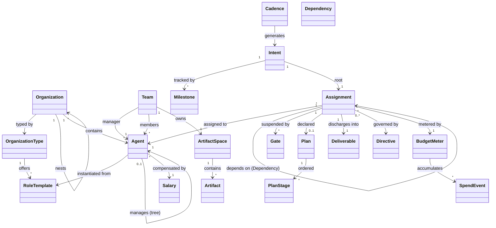

# Domain Model — Agent Organizations

This document defines the domain layer only: the concepts, their relationships, their lifecycles, and the invariants that hold regardless of execution backend, sandbox technology, or UI. Roles are catalog data, never code — nothing in the base model knows what a "software engineer" or "line cook" is.

## The model at a glance



Four layers, each depending only on the layer above it:

1. **Catalog** — what kinds of organizations and roles *can exist* (OrganizationType, RoleTemplate)
2. **Structure** — a specific organization the user has built (Organization, Agent, Team, ArtifactSpace)
3. **Work** — what the organization is doing right now (Intent, Milestone, Cadence, Assignment, Dependency, Gate, Directive, Plan, Deliverable, Artifact)
4. **Economics** — what the work costs and where authority intervenes (Salary, BudgetMeter, SpendEvent)

---

## 1. Catalog layer

### OrganizationType

A named archetype: `software-company`, `franchise-operation`, `research-lab`. It is pure data — a key, a description, and the set of RoleTemplates it offers. When a user picks an OrganizationType in the editor, the role palette they can drag from *is* this set. Types are open for extension: users and the community define new ones without touching the core.

### RoleTemplate

The prebuilt functionality behind a role. A RoleTemplate carries:

- **key + title** — `software-engineer`, `qa-tester`, `line-cook`
- **base instructions** — the persona/behavior contract an Agent inherits
- **responsibilities** — named duties this role is expected to discharge (see Responsibility below)
- **tool grants** — the default toolset an Agent of this role receives in its workspace
- **deliverable contract** — the default expected output shape (artifact type or action attestation)
- **default salary** — a starting token allowance, overridable per Agent
- **effort expectations** — baseline token/duration envelopes for its responsibilities, the primary source for overrun detection, continuously calibrated by the platform against historical actuals (see Economics)

A RoleTemplate is a *template*, not an instance. It never executes. It is versioned, so an Organization built on `software-engineer@2` is unaffected when the catalog ships `@3`.

### Responsibility

A named duty with a completion contract: "review pull requests → produces ReviewReport artifact", "call assigned customers → produces CallAttestation". Responsibilities live on RoleTemplates and can be *added* to individual Agents at design time (user extends a node) or per-engagement (a manager issues a Directive — see below). Every Responsibility declares what discharging it looks like, which is what makes agent progress observable and checkable rather than vibes-based.

A Responsibility may mark specific actions as **governed**: actions with real-world consequences (contact a customer, spend money, publish something) that require consent *before* they happen, not attestation after. Reaching a governed action opens an ApprovalGate (see Gates).

---

## 2. Structure layer

### Organization

An Organization is an instance: "Acme Software," typed `software-company`. It has one OrganizationType, an org chart of Agents, and optionally nested child Organizations ("Acme Customer Service" typed `support-center` inside "Acme Software"). A nested Organization is a full Organization — its own type, its own role palette, its own chart — attached at a mount point: its root Agent reports to a designated Agent in the parent. From the parent's perspective, the child org's root looks like any other report; the parent cannot see inside it. This gives you franchises (one parent, many identical child orgs) and departments (one specialized child) with a single mechanism.

An Organization has no separate "goal" object. Its goal *is* the standing Intent addressed to its root Agent (see Intent below) — the thing the org exists to deliver right now.

### Agent

The Agent is the node in the chart — one concept, not a definition/instance split. An Agent has:

- **identity** — stable ID, name, the Organization it belongs to
- **role binding** — the RoleTemplate (and version) it instantiates
- **extensions** — additional Responsibilities and instruction overrides layered on top of the template by the user
- **reporting edge** — zero or one manager (zero only for the org root). The chart is a tree; every Agent has exactly one manager and any number of reports.
- **salary** — its token allowance policy (economics layer)
- **workspace** — an isolated execution environment provisioned per Assignment and torn down after. Workspaces are private by invariant: no Agent can read or write another Agent's workspace, ever. All inter-agent exchange happens through Artifacts and Messages, mediated by the platform, not by shared disk.
- **memory** — durable, platform-managed experience the Agent carries across Assignments, distinct from the disposable workspace. Memory is inspectable and resettable by the user: replacing an Agent's memory without touching the chart is the domain's version of "backfilling the position."
- **status** — derived, observable state: `idle`, `engaged`, `gated`, `paused`

An Agent **executes one Assignment at a time** — one unit of attention, like a person. A gated Assignment does not hold the node: it suspends with its workspace preserved, the Agent picks up the next queued Assignment, and when the gate resolves the suspended Assignment returns to the front of the queue — it never preempts work mid-stage. A small per-Agent **WIP cap** bounds concurrent suspensions, because context switches aren't free for an LLM — every resume reloads context, and an uncapped switcher burns its salary on swap overhead. A growing queue behind a node is still a structural bottleneck made visible, and the fix is still structural — add another node.

### Team

A Team is a manager plus its direct reports — derived from the tree, not separately drawn. The Team is the collaboration boundary: members share one ArtifactSpace and can message each other. By default, two Agents in different Teams cannot communicate directly; their exchange travels up through the common manager. Teams stay within their own concern — there is no cross-team membership, no matrix structure, no standing surface that bypasses the chart. The chart can, however, explicitly open two scoped exceptions — **cross-team grants** and **brokered channels** (see ArtifactSpace and Gates) — both manager-granted, Assignment-scoped, expiring, and audited. The communication topology is the reporting topology plus the connections the chart itself chose to make, which is what makes an org chart *mean* something at runtime.

### ArtifactSpace and Artifact

Each Team owns one ArtifactSpace: a namespaced, versioned store of Artifacts. An Artifact is an immutable, addressable unit of produced work:

- **ref** — globally unique, stable address: `org://acme/eng-team/design-doc@3`
- **type** — from an open vocabulary (document, code-patch, report, dataset…)
- **provenance** — which Agent produced it, discharging which Assignment, at what cost
- **content** — the payload itself, stored by the platform, never inside any Agent's workspace

Artifacts are immutable; revising one produces `@4` with a link to `@3`. Any Team member can resolve any ref in its space. This is the mechanism behind "the QA agent tests what the engineer built": the engineer's Assignment discharges into an Artifact, the ref lands in the shared space, and the QA agent's brief cites that ref. Cross-team sharing is explicit: a manager *publishes* an Artifact from its team's space up into the space it shares with its peers and its own manager, one level at a time, along the tree. When only a single consumer needs a ref, publishing a level up is overkill: a manager may instead issue a **cross-team grant** — read access to one ref (and its version lineage) for one specific Assignment in another team. Grants are cheap and safe by construction — artifacts are immutable, access is read-only and logged — and they expire with the Assignment.

---

## 3. Work layer

### Intent

An Intent is what the user actually asks for. It is addressed to exactly one Agent — typically the org root (the CEO case), but any node can receive one directly — and it is the provenance root: every Assignment, Artifact, and token spent below it traces back to it.

Intents come in two durations. An **episodic** Intent is a bounded ask ("ship a landing page by Friday") that closes when its root Assignment closes. A **standing** Intent is open-ended ("build the #1 AI note-taking app") — it *is* the organization's goal, it stays open, and successive waves of delegation and Milestones hang off it. There is no separate Goal concept; the standing Intent on the root node is the goal.

### Milestone

A Milestone is a named checkpoint on an Intent: a title, a target date, acceptance criteria, and links to the Assignments/Deliverables that satisfy it. Milestone status is **derived, never hand-toggled**: `met` when its linked Deliverables are accepted, `missed` when the date passes without that, and `at_risk` when the rolled-up estimates of in-flight work project past the target date. Milestones are the time axis of progress; the Assignment tree is the completion axis. Together they answer "how is the org doing against the plan" the way a real exec review would.

**Progress is a derived view, not stored state.** For any Intent: milestone statuses, the fraction of the Assignment tree closed/accepted, current stage cursors, and spend against budget. Bottlenecks fall out of the same objects: queues behind Agents, long-open Gates, and stages running past estimate. The editor renders all of this on the live chart; nothing extra is recorded to make it possible.

### Cadence

A Cadence is recurring work on a schedule — the domain's version of the operating rhythm every real org has. A Cadence is a template that generates an episodic Intent at each occurrence: the **daily status report** (root Agent compiles progress across its subtree into a report Artifact), the weekly review, the monthly close. Cadences are the mechanism for proactive engagement with standing Intents — "review where we are and reprioritize" has no triggering event, so the schedule is the trigger. Cadences are user-defined at any node, and RoleTemplates may ship defaults (a manager role that comes with a weekly sync).

### Assignment

The Assignment is the central working object of the whole model — the unit that carries state, budget, plan, and deliverable. An Assignment binds:

- **an Agent** (who), **a brief** (what, including cited Artifact refs), **a Deliverable contract** (what done looks like), **a BudgetMeter** (economics), **a parent** (the Assignment or Intent it serves)

Delegation is Assignment creation: when the CEO receives an Intent, it discharges its own Assignment *by creating child Assignments on its direct reports* and later accepting their Deliverables. Delegation only travels along reporting edges — a manager can assign to its reports and no one else. The Assignment tree that grows out of one Intent is therefore always a subtree-shaped trace of the org chart, and answers "why is this agent doing this?" at every level.

### Dependency

When a manager fans an Intent out into parallel child Assignments, the children are rarely independent — QA tests what the engineer built. A Dependency is a directed edge between sibling Assignments: *B starts when A's Deliverable is accepted.* Dependencies are declared by the manager at delegation time (they are part of how a manager decomposes work, not something children negotiate). While any dependency is unmet, the downstream Assignment sits behind a DependencyGate — genuinely idle, consuming nothing. When the last upstream Deliverable is accepted, the gate resolves automatically and the accepted Artifact refs are injected into the downstream brief. Dependencies never cross team boundaries; cross-team sequencing is expressed one level up, between the managers' own Assignments.

### Gates

Everything that legitimately stops work is one mechanism: a **Gate** — a suspension of an Assignment pending an external resolution. A Gate has a kind, an owner (who can resolve it), an opened-at time, and a resolution. The Assignment state `gated` means "has at least one open Gate," the live chart shows which kind, and — critically — a gated Assignment releases its Agent to work the queue. Five kinds:

- **ClarificationGate** — waits on a *better brief*: opened during brief intake when the Agent's cheap feasibility check finds the ask defective — the Deliverable contract can't be met from this brief, these refs, these tools. Owned by the issuing manager. Its resolution is not an answer but a **revised brief**, and briefs are versioned; that version history is the accountability record that drives rework funding (below). Catching a bad brief here costs a sliver of tokens; catching it at rejection costs the whole first attempt.
- **DependencyGate** — waits on *work*: upstream sibling Deliverables. Resolves automatically on acceptance. No judgment involved.
- **ApprovalGate** — waits on *authority*: a governed action needs consent before it happens (contact a real customer, spend real money, publish), or a budget top-up needs granting. Owned by the manager when within its granted limits, otherwise the user. Approval resumes execution; **denial is a prohibition, not a rework request** — the Agent must re-plan around the denied path or the Assignment is cancelled.
- **EscalationGate** — waits on an *answer*: the Agent is stuck on a decision above its pay grade and asks upward. Owned by the manager (who may escalate further up). The resolution is an answer — text, Artifact refs, a cross-team grant, or an **introduction**: when the real answer lives in another team, the common manager resolves the escalation by opening a temporary **brokered channel** — direct peer-to-peer messaging between the two Agents, scoped to the Assignment, expiring with it, fully logged. One routing decision instead of per-message relaying: "go talk to Sarah on backend." Reports that can only silently succeed or fail will burn meters guessing; asking is cheaper.
- **InterventionGate** — waits on a *remedy*: the platform itself opened it because something crossed a threshold (see Economics). Owned by the manager first, escalating to the user.

Dependencies and approvals are deliberately the same mechanism but not the same thing, and the distinction is worth stating precisely: a dependency is satisfied by **work** and resolves mechanically the moment the work is accepted; an approval is satisfied by **judgment** and no amount of work can resolve it. Their failure semantics differ too — an unmet dependency just waits, while a denied approval forbids a path. Modeling both as Gates gives them one suspension/observability surface without pretending they're interchangeable.

**Assignment lifecycle:**

```
created → briefed → intake ⇄ ClarificationGate
                      ↓
                   planning → executing → delivering → accepted → closed
                      ↑                        |
                      └──────── rejected ──────┘   (rework: see funding rule)

any active state ⇄ gated (clarification | dependency | approval | escalation | intervention)
a gated Assignment releases its Agent; the node works its queue and resumes at the front on resolution
user hold: any active state ⇄ paused
terminal: cancelled, failed
```

**Brief intake** is the new first act: before accepting the meter and planning, the Agent runs a cheap feasibility check of the brief against its Deliverable contract, opening a ClarificationGate if the ask is defective. `accepted` is granted by the *manager* (or the user, for a root Assignment): the deliverable is checked against the contract. Rejection sends the Assignment back to `planning`, and **who funds the rework follows the brief's version history**: if the brief stands unchanged, rework burns the original meter — genuine quality failure stays visibly expensive, and a rework spiral walks into the warn/hard-stop thresholds on its own. If the manager revises the brief for the rework round, the delta is funded from the **parent Assignment's meter** — a re-scope is the manager's failure, and it surfaces as the manager's cost, one level up, where the Intent-tree rollup keeps it honest.

### Plan and PlanStage

On entering `planning`, the Agent declares a Plan: an ordered list of PlanStages, each with a description, a completion signal, and the Agent's **advisory sizing** — structure and relative size (small/medium/large), which LLMs can meaningfully judge. What agents cannot meaningfully produce is absolute numbers: token self-estimates are confabulated, and wall-clock is dominated by gates, queues, and human latency the Agent can't see. So **absolute envelopes come from the Economics layer, not the Plan**: the platform attaches an expected token and duration envelope to each stage, derived from RoleTemplate baselines calibrated against historical actuals. The Agent's advisory sizing is still recorded — and *divergence* between it and the baseline ("my report thinks this is much bigger than normal") is itself an early review flag at plan time. This split is also Goodhart-proof: an agent cannot move its own tripwire by padding estimates.

### Step

At execution time, each PlanStage decomposes into **Steps** — the atomic units the framework actually observes and controls. A Step is one model call or one tool call, recorded with its input tokens, output tokens, duration, and **delta**: what changed because it ran (artifact content produced or revised, a tool effect, stage-progress advanced, or nothing — a step with no delta is itself a signal). Steps are framework-level facts, not agent self-reports: the runtime sits between the Agent and the model, so every call is metered whether the Agent is cooperative or not. Budget enforcement happens **between Steps** — the meter is checked before each dispatch, which is what makes the hard-stop invariant mechanical rather than a request politely made to an LLM.

The Plan is a first-class, observable object — not internal chain-of-thought. During `executing`, the Assignment exposes a stage cursor, actuals-vs-envelope per stage, and full drill-down: **Assignment → Plan → PlanStage → Step → SpendEvent**. When a stage misbehaves, you don't just see *that* it overran — you open it and see *which steps* burned the tokens and what delta each one bought. This is the manager's-eye view, and it's also how a manager *knows* a report is stuck: "taking too long" is measurable, not a feeling. A stage running past its envelope is a signal (see Economics) before it is a failure. Plans can be revised mid-flight; revisions are versioned and visible.

### Deliverable

Every Assignment discharges into exactly one Deliverable, which is one of two kinds:

- **ArtifactDeliverable** — a ref to one or more produced Artifacts ("here is the design doc")
- **ActionAttestation** — a signed claim that an action was performed in the world, with evidence attached ("called customer #4412; call log attached")

This union is deliberate: it makes "the sales agent who creates nothing" a first-class citizen rather than an awkward exception. An attestation has the same provenance, acceptance flow, and budget accounting as an artifact. Note the division of labor with Gates: consequential actions are *approved before* (ApprovalGate) and *attested after* (ActionAttestation) — consent and evidence are different objects.

### Directive

A Directive is a manager-issued behavioral extension to a report: added instructions, an added Responsibility, a constraint ("use the existing design system"). This is the mechanism behind "the user only instructs the CEO": the CEO's delegation isn't just task assignment, it is also Directive issuance — shaping *how* each report should operate for this engagement. **Directives are always Assignment-scoped.** They live and die with the Assignment; only the user, through the editor, permanently changes an Agent. The drawn chart is therefore always the truth of the running org.

### Message

Agents communicate through Messages on platform-mediated channels: manager↔report (always), teammate↔teammate within a Team, and — when a common manager resolves an escalation with an introduction — a **brokered channel** between two specific Agents across teams, scoped to one Assignment, expiring with it, fully logged. Messages carry text and Artifact refs — never raw workspace contents. There is no channel the chart didn't create.

Channel telemetry is itself a product surface: two teams that keep needing introductions are Conway's law talking back — the chart shape is wrong for the work. The editor should surface "these teams keep getting introduced" as a re-org suggestion rather than letting the workaround quietly become the real structure.

---

## 4. Economics layer

Salary is a critical feature, so it is modeled as a core object with its own lifecycle — not a metadata field.

### Salary

Attached to each Agent: the token allowance policy for its work. A Salary defines the **per-assignment allowance** (the default budget each Assignment gets), a **warn threshold** (percentage at which alerts fire, default 80%), and a **hard-stop policy** (gate on breach — on by default). RoleTemplates ship a default Salary; the user overrides per node in the editor.

### BudgetMeter

Every Assignment gets a BudgetMeter at creation, funded from the Agent's Salary (a manager can grant an override for a known-large task — visibly, through an ApprovalGate if beyond its authority). The meter accumulates SpendEvents and evaluates thresholds continuously, not at end-of-run.

### SpendEvent

The atomic cost record, emitted per **Step**: every model or tool call attributed to (agent, assignment, plan stage, step, team, organization, timestamp, tokens in/out, cost). Attribution to the Step is what makes cost *analyzable* rather than merely *accounted*: because Assignments form a tree under an Intent, spend rolls up naturally — step → stage → assignment → delegation subtree → intent → org — and drills down the same path. "What did the landing page cost" is a rollup; "why did stage 3 cost triple its envelope" is a drill-down to the exact steps that burned it and the delta each one bought.

### Calibration

The platform continuously fits expected envelopes per (RoleTemplate, Responsibility, deliverable type) from accumulated Step actuals — these baselines set every tripwire above, and the Agent never sets its own. Calibration compounds: every Assignment the platform runs makes every future envelope sharper, which is an asset no fresh deployment has on day one.

### Intervention triggers

Managers exist to unblock reports, so the platform watches for the signals a good manager watches for, and opens an **InterventionGate** when one fires:

1. **Budget warn** — meter crosses the warn threshold. Surfaced on the live node (burn rate, stage cursor, projected overrun); work continues.
2. **Budget hard-stop** — meter exhausted. Work halts *before the next model call*, workspace freezes, gate opens.
3. **Envelope overrun** — a stage (or the Assignment's rollup) runs materially past its platform-set envelope in time or tokens. This is the "my report said Tuesday and it's Thursday" signal, with the tripwire set by role baselines and calibration, never by the Agent's own numbers.
4. **Stall** — no stage progress, no Step delta, or no activity at all within a liveness bound. Distinct from overrun: a stalled agent burns nothing and goes nowhere, which a budget meter alone can never see. Steps that run but produce no delta are the early form of this signal.

Interventions route to the **manager first** — with bounded auto-resolution authority ("approve up to +20% once", "answer and resume") so small problems don't stall the org — and escalate to the user when beyond that authority or left unresolved. The user watching the chart sees the node glow at warn, and gets the full resolution set at a gate: raise the meter, narrow the brief, reassign, answer, or cancel.

---

## Invariants

These hold everywhere, by construction, and are the contract the execution layer must honor:

1. **The chart is a tree.** Every Agent has exactly one manager; the org root has none.
2. **Workspace isolation is absolute.** No Agent reads or writes another's workspace. Exchange is Artifacts and Messages, platform-mediated, or nothing.
3. **Communication follows the chart — or channels the chart explicitly opened.** Manager↔report and within-team by default; cross-team only via manager-granted, Assignment-scoped, expiring, audited grants and brokered channels. No self-made back-channels.
4. **Delegation follows the chart.** Assignments are created only by an Agent's direct manager (or by an Intent at its entry node). Dependencies connect siblings only.
5. **Artifacts are immutable and addressable.** Revision creates a new version; refs never dangle.
6. **Every Deliverable traces to an Intent.** The provenance chain (Deliverable → Assignment → … → Intent) is never broken.
7. **No work without a meter, and the meter is mechanical.** An Assignment cannot enter `executing` without a funded BudgetMeter. Enforcement is framework-level, between Steps: the runtime sits between the Agent and the model, checks the meter before every dispatch, and halts before the breaching call — the LLM is never asked to limit itself, and cannot opt out of being metered.
8. **All suspension is a Gate.** If an Assignment isn't progressing, there is exactly one place to look: its open Gates, each with a kind and an owner.
9. **Consequential actions are consented, then evidenced.** Governed actions require an ApprovalGate before execution and an ActionAttestation after.
10. **Credentials never enter an Agent.** Tool credentials are platform-held, bound to tool grants, injected at call time, and every access is logged. Nothing secret lives in a workspace or in durable memory.
11. **Roles are data.** The core model contains no role-specific or org-type-specific behavior.

## Resolved design decisions

- **Agent memory: durable.** Agents accumulate experience across Assignments (platform-managed, inspectable, resettable), separate from the per-Assignment workspace which is always fresh.
- **Directives: Assignment-scoped only.** Managers shape behavior per engagement; only the user permanently changes an Agent. The chart never drifts from what was drawn.
- **Concurrency: one *executing* Assignment per Agent.** Gated Assignments suspend and release the node (WIP-capped); resolution resumes at front-of-queue without preemption. Parallelism is still achieved structurally, by adding nodes.
- **Rework funding follows brief versions.** Unchanged brief → same meter (quality failure stays the report's cost). Revised brief → the parent's meter funds the delta (re-scoping is the manager's cost, visible one level up).
- **Goal = standing Intent.** No separate Goal object; the standing Intent on the root node is the organization's goal, with Milestones as its checkpoints.
- **Approvals and dependencies are both Gates, but not the same thing.** Dependencies are satisfied by work and resolve mechanically; approvals are satisfied by judgment and denial prohibits rather than requests rework.
- **Cross-team: grants + brokered channels.** Managers may grant read access to specific cross-team artifact refs and resolve escalations with temporary peer channels — always scoped, expiring, audited. Repeat introductions between the same teams surface as a re-org signal.
- **Envelopes are platform-set; enforcement is framework-level.** Absolute token/time tripwires come from RoleTemplate baselines + calibration, never the Agent's own numbers. Metering and hard-stops are enforced by the runtime between Steps — per-call accounting with observable deltas, drillable from Assignment down to the individual Step.

## Explicit non-goals (v1)

- **Projects.** Cross-cutting membership that spans the chart creates exactly the back-channels invariant 3 forbids. Useful someday; omitted entirely for now, and anything project-shaped is expressed as delegation under an Intent.
- **Pipelines.** Batch "run this workflow over N cases" is a different product. If needed later, it composes on top (an Intent per case) rather than living in the domain.
- **Blueprints (org serialization/templates).** The structure layer is designed to be serializable — chart + role bindings + salaries, explicitly excluding memory, secrets, and in-flight work — but the template/marketplace design is a future conversation, deliberately deferred.

## Remaining open items

- **Sub-org opacity** — asserted: the parent sees only the child org's root. Revisit if a real use case needs cross-org visibility.
- **Memory shape** — durable memory is decided; *what* is remembered (summaries of past Assignments? accepted deliverables only? failures too?) and how it's compacted is an execution-layer design, to be specified with the SDK.
- **Queue policy** — ordering (FIFO vs manager-set priority) and the default WIP cap value are unspecified; both should stay small, swappable policies.
- **Cold-start envelopes** — calibration is now core (see Economics), but the first runs of a new RoleTemplate have no history; shipping sane default envelopes with catalog templates is a catalog-authoring concern.
- **Step delta taxonomy** — Steps record a delta, but the vocabulary of deltas (artifact-diff, tool-effect, progress-marker, none) needs a small closed enum at the SDK layer so "no delta" is detectable mechanically rather than judged.
